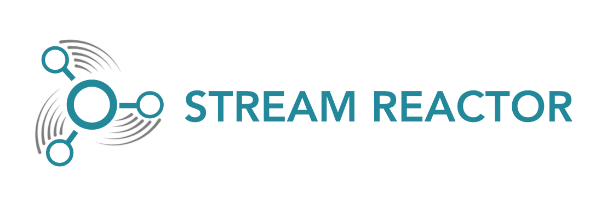

# Stream Reactor Dockers

[](https://travis-ci.org/lensesio/stream-reactor-dockers)


Dockers are published
to [streamreactor](https://cloud.docker.com/u/streamreactor/repository/list)
dockerhub repo from Stream Reactor versions 1.2.1 and higher. Previous versions
can be found
at [datamountaineer](https://cloud.docker.com/u/datamountaineer/repository/list)

Environment variables prefixed with `CONNECTOR` are used to create a connector
properties file. Environment variables beginning with `CONNECT` are used to
create the properties file for the Kafka Connect Cluster. The Connector
properties file is then pushed via DataMountaineers
Connect [CLI](https://github.com/lensesio/kafka-connect-tools) to the Connect
workers API once it's up to start the connector.

The expected use case is that the Connect Worker joins with other pods deployed
via [Helm](https://helm.sh/) to form a Connect Cluster for a specific instance
of one connector only. It can only post in a configuration for one type based on
the environment variables.

For an awesome deployment app to deploy your landscape checkout
Eneco's [Landscaper](https://github.com/Eneco/landscaper).

For example:

```bash
docker run \
     -e CONNECT_REST_PORT=8083 \
         -e CONNECT_GROUP_ID="test" \
         -e CONNECT_STATUS_STORAGE_TOPIC="tes" \
         -e CONNECT_CONFIG_STORAGE_TOPIC="test" \
         -e CONNECT_OFFSET_STORAGE_TOPIC="test2" \
         -e CONNECT_BOOTSTRAP_SERVERS="kafka-1:9092" \
         -e CONNECT_KEY_CONVERTER="io.confluent.connect.avro.AvroConverter" \
         -e CONNECT_VALUE_CONVERTER="io.confluent.connect.avro.AvroConverter" \
         -e CONNECT_INTERNAL_KEY_CONVERTER="org.apache.kafka.connect.json.JsonConverter" \
         -e CONNECT_INTERNAL_VALUE_CONVERTER="org.apache.kafka.connect.json.JsonConverter" \
         -e CONNECT_REST_ADVERTISED_HOST_NAME="blat" \
         -e CONNECT_KEY_CONVERTER_SCHEMA_REGISTRY_URL="http://sr-0:8081" \
         -e CONNECT_VALUE_CONVERTER_SCHEMA_REGISTRY_URL="http://sr-0:8081" \
         -e CONNECTOR_CONNECTOR_CLASS="com.datamountaineer.streamreactor.connect.elastic.ElasticSinkConnector" \
         -e CONNECTOR_NAME="elasticsearch-sink-orders" \
         -e CONNECTOR_TASKS_MAX=1 \
         -e CONNECTOR_CONNECT_ELASTIC_SINK_KCQL="INSERT INTO index_1 SELECT * FROM orders-topic" \
         -e CONNECTOR_TOPICS="topic_consumer_logs" \
         -e CONNECTOR_CONNECT_ELASTIC_URL="http://elastic_url" \
         -e CONNECTOR_CONNECT_ELASTIC_CLUSTER_NAME="elasticsearch" \
         lensesio/kafka-connect-elastic:1.2.1
```

## Helm

[Helm charts](https://github.com/lensesio/kafka-helm-charts) are available for
deployment into Kubernetes.

## Secrets

Secrets, .i.e. connections to data stores can be stored in external systems such
as Hasihcorp Vault, Azure Keyvault or as retrieved from environment variables.

Since release 2.0.0 the dockers now support Config Providers for

*   Azure KeyVault
*   AWS Secret Manager
*   Hashicorp Vault
*   Environment variables - intended for use with kubernetes secrets

See Lenses [Documentation](https://docs.lenses.io/connectors/secret-providers.html) for usage.

**Pre 2.0.0**

Pior releases use the Lenses CLI .The Lenses CLI is included in the base connect image. This will run and
configure the Connect properties files. Setting the `SECRETS_PROVIDER` variable
determines how to retrieve the values. Either `env`, `vault` or`azure`.

To have secrets written to a separate file prefix them with `SECRET_`. See
the [Lenses CLI](https://docs.lenses.io/dev/lenses-cli/index.html#) for more
details.
